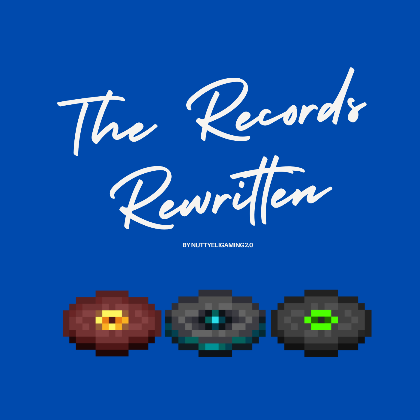

  

  # The Records Rewritten by NuttyeliGaming2.0

  **I put songs into minecraft with the help of my friends. I put a lot of hard work into this so I hope you like this!**

  

---

### ⚠️**ATTENTION**⚠️ 
- The newest version has the Bedrock and Java version in as well as an extra! Please refer to the Versions or Changelog Tab to download another version. All versions will be labled.

- This resource pack is recommended to be used with Jukebox Custom Disc Fix
by eclipseisoffline.

- It will say that this pack is made for an older version of minecraft, but it will work. This resource pack does not require anything, just a minecraft instance.

- To see the songs added, please check the versions tab and select the version you want!

### Ways to Install:

Modrinth App:
Just click the download button and all will be fine!

Modrinth:
1. Click the download button, and click download. 
2. Next, open up your minecraft, go to settings, resource packs, and drag and drop this into the pack folder.
3. Now just click on the resource pack, click yes on the prompt, "This resource pack was made for an older version of minecraft" if it appears.
4. If it does not show up, try rebooting minecraft and if it still doesent work, try re downloading this resource pack.

If you want to download an earlier version of this resource pack, as I will be creating and updating this, please check the versions.

### Suggest what I should Rewrite the Records with!
[https://forms.office.com/r/Y7cnaebh7t](https://forms.office.com/r/Y7cnaebh7t)

### **Licence & Usage**
- This project is managed by Isaac Firth and is part of the Maple Leaf Originisation.
- This project is released under the MIT License.
Editing or redistributing this pack requires explicit permission from the owner. Unauthorized copies, reuploads, or modified versions will be taken down immediately.
- This Resource Pack can and does use other artist's songs. This pack will follow any guidelines requested by the artist.
